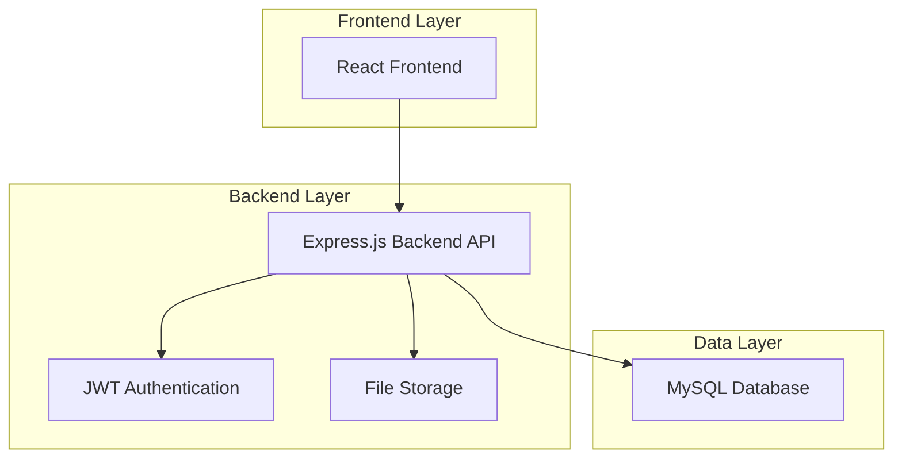
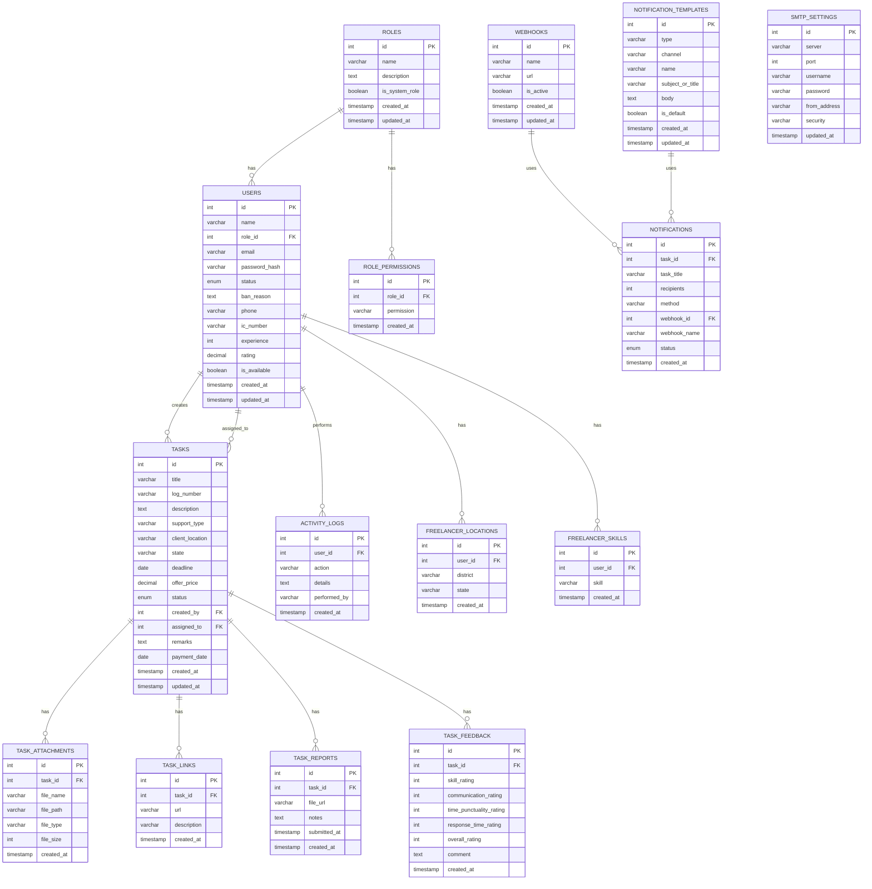

# Dokumentasi Teknikal: Integrasi MySQL untuk Sistem SPFIT

## 1. Arsitektur Sistem



## 2. Teknologi Stack

- **Frontend**: React@19 + TypeScript + Vite
- **Backend**: Node.js + Express.js + TypeScript
- **Database**: MySQL 8.0+
- **ORM**: Prisma atau TypeORM
- **Authentication**: JWT + bcrypt
- **File Upload**: Multer
- **API Documentation**: Swagger/OpenAPI

## 3. Skema Database MySQL

### 3.1 Model Data Utama



### 3.2 DDL (Data Definition Language)

```sql
-- Create database
CREATE DATABASE spfit_db CHARACTER SET utf8mb4 COLLATE utf8mb4_unicode_ci;
USE spfit_db;

-- Roles table
CREATE TABLE roles (
    id INT PRIMARY KEY AUTO_INCREMENT,
    name VARCHAR(50) NOT NULL UNIQUE,
    description TEXT,
    is_system_role BOOLEAN DEFAULT FALSE,
    created_at TIMESTAMP DEFAULT CURRENT_TIMESTAMP,
    updated_at TIMESTAMP DEFAULT CURRENT_TIMESTAMP ON UPDATE CURRENT_TIMESTAMP
);

-- Role permissions table
CREATE TABLE role_permissions (
    id INT PRIMARY KEY AUTO_INCREMENT,
    role_id INT NOT NULL,
    permission VARCHAR(100) NOT NULL,
    created_at TIMESTAMP DEFAULT CURRENT_TIMESTAMP,
    FOREIGN KEY (role_id) REFERENCES roles(id) ON DELETE CASCADE,
    UNIQUE KEY unique_role_permission (role_id, permission)
);

-- Users table (includes both staff and freelancers)
CREATE TABLE users (
    id INT PRIMARY KEY AUTO_INCREMENT,
    name VARCHAR(100) NOT NULL,
    role_id INT NOT NULL,
    email VARCHAR(255) UNIQUE,
    password_hash VARCHAR(255),
    status ENUM('Aktif', 'Tidak Aktif', 'Disekat') DEFAULT 'Aktif',
    ban_reason TEXT,
    phone VARCHAR(20),
    ic_number VARCHAR(20),
    experience INT DEFAULT 0,
    rating DECIMAL(3,2) DEFAULT 0.00,
    is_available BOOLEAN DEFAULT TRUE,
    created_at TIMESTAMP DEFAULT CURRENT_TIMESTAMP,
    updated_at TIMESTAMP DEFAULT CURRENT_TIMESTAMP ON UPDATE CURRENT_TIMESTAMP,
    FOREIGN KEY (role_id) REFERENCES roles(id),
    INDEX idx_email (email),
    INDEX idx_status (status),
    INDEX idx_role_id (role_id)
);

-- Freelancer locations
CREATE TABLE freelancer_locations (
    id INT PRIMARY KEY AUTO_INCREMENT,
    user_id INT NOT NULL,
    district VARCHAR(100) NOT NULL,
    state VARCHAR(50) NOT NULL,
    created_at TIMESTAMP DEFAULT CURRENT_TIMESTAMP,
    FOREIGN KEY (user_id) REFERENCES users(id) ON DELETE CASCADE,
    INDEX idx_user_id (user_id),
    INDEX idx_state (state)
);

-- Freelancer skills
CREATE TABLE freelancer_skills (
    id INT PRIMARY KEY AUTO_INCREMENT,
    user_id INT NOT NULL,
    skill VARCHAR(100) NOT NULL,
    created_at TIMESTAMP DEFAULT CURRENT_TIMESTAMP,
    FOREIGN KEY (user_id) REFERENCES users(id) ON DELETE CASCADE,
    INDEX idx_user_id (user_id),
    INDEX idx_skill (skill)
);

-- Tasks table
CREATE TABLE tasks (
    id INT PRIMARY KEY AUTO_INCREMENT,
    title VARCHAR(255) NOT NULL,
    log_number VARCHAR(50) UNIQUE NOT NULL,
    description TEXT NOT NULL,
    support_type VARCHAR(100) NOT NULL,
    client_location VARCHAR(255) NOT NULL,
    state VARCHAR(50) NOT NULL,
    deadline DATE NOT NULL,
    offer_price DECIMAL(10,2) NOT NULL,
    status ENUM('Baru', 'Tawaran Dihantar', 'Telah Diambil', 'Selesai', 'Borang Disemak & Pembayaran Tertunggak', 'Telah Dibayar', 'Dibatalkan', 'Selesai Penuh') DEFAULT 'Baru',
    created_by INT NOT NULL,
    assigned_to INT,
    remarks TEXT,
    payment_date DATE,
    created_at TIMESTAMP DEFAULT CURRENT_TIMESTAMP,
    updated_at TIMESTAMP DEFAULT CURRENT_TIMESTAMP ON UPDATE CURRENT_TIMESTAMP,
    FOREIGN KEY (created_by) REFERENCES users(id),
    FOREIGN KEY (assigned_to) REFERENCES users(id),
    INDEX idx_status (status),
    INDEX idx_created_by (created_by),
    INDEX idx_assigned_to (assigned_to),
    INDEX idx_support_type (support_type),
    INDEX idx_state (state)
);

-- Task attachments
CREATE TABLE task_attachments (
    id INT PRIMARY KEY AUTO_INCREMENT,
    task_id INT NOT NULL,
    file_name VARCHAR(255) NOT NULL,
    file_path VARCHAR(500) NOT NULL,
    file_type VARCHAR(50),
    file_size INT,
    created_at TIMESTAMP DEFAULT CURRENT_TIMESTAMP,
    FOREIGN KEY (task_id) REFERENCES tasks(id) ON DELETE CASCADE,
    INDEX idx_task_id (task_id)
);

-- Task links
CREATE TABLE task_links (
    id INT PRIMARY KEY AUTO_INCREMENT,
    task_id INT NOT NULL,
    url VARCHAR(500) NOT NULL,
    description VARCHAR(255),
    created_at TIMESTAMP DEFAULT CURRENT_TIMESTAMP,
    FOREIGN KEY (task_id) REFERENCES tasks(id) ON DELETE CASCADE,
    INDEX idx_task_id (task_id)
);

-- Task reports
CREATE TABLE task_reports (
    id INT PRIMARY KEY AUTO_INCREMENT,
    task_id INT NOT NULL UNIQUE,
    file_url VARCHAR(500),
    notes TEXT,
    submitted_at TIMESTAMP NOT NULL,
    created_at TIMESTAMP DEFAULT CURRENT_TIMESTAMP,
    FOREIGN KEY (task_id) REFERENCES tasks(id) ON DELETE CASCADE
);

-- Task feedback
CREATE TABLE task_feedback (
    id INT PRIMARY KEY AUTO_INCREMENT,
    task_id INT NOT NULL UNIQUE,
    skill_rating INT NOT NULL CHECK (skill_rating >= 1 AND skill_rating <= 5),
    communication_rating INT NOT NULL CHECK (communication_rating >= 1 AND communication_rating <= 5),
    time_punctuality_rating INT NOT NULL CHECK (time_punctuality_rating >= 1 AND time_punctuality_rating <= 5),
    response_time_rating INT NOT NULL CHECK (response_time_rating >= 1 AND response_time_rating <= 5),
    overall_rating INT NOT NULL CHECK (overall_rating >= 1 AND overall_rating <= 5),
    comment TEXT,
    created_at TIMESTAMP DEFAULT CURRENT_TIMESTAMP,
    FOREIGN KEY (task_id) REFERENCES tasks(id) ON DELETE CASCADE
);

-- Activity logs
CREATE TABLE activity_logs (
    id INT PRIMARY KEY AUTO_INCREMENT,
    user_id INT NOT NULL,
    action VARCHAR(255) NOT NULL,
    details TEXT,
    performed_by VARCHAR(100) NOT NULL,
    created_at TIMESTAMP DEFAULT CURRENT_TIMESTAMP,
    FOREIGN KEY (user_id) REFERENCES users(id) ON DELETE CASCADE,
    INDEX idx_user_id (user_id),
    INDEX idx_created_at (created_at)
);

-- Webhooks
CREATE TABLE webhooks (
    id INT PRIMARY KEY AUTO_INCREMENT,
    name VARCHAR(100) NOT NULL,
    url VARCHAR(500) NOT NULL,
    is_active BOOLEAN DEFAULT TRUE,
    created_at TIMESTAMP DEFAULT CURRENT_TIMESTAMP,
    updated_at TIMESTAMP DEFAULT CURRENT_TIMESTAMP ON UPDATE CURRENT_TIMESTAMP
);

-- Notification templates
CREATE TABLE notification_templates (
    id INT PRIMARY KEY AUTO_INCREMENT,
    type VARCHAR(50) NOT NULL,
    channel ENUM('E-mel', 'Webhook') NOT NULL,
    name VARCHAR(100) NOT NULL,
    subject_or_title VARCHAR(255) NOT NULL,
    body TEXT NOT NULL,
    is_default BOOLEAN DEFAULT FALSE,
    created_at TIMESTAMP DEFAULT CURRENT_TIMESTAMP,
    updated_at TIMESTAMP DEFAULT CURRENT_TIMESTAMP ON UPDATE CURRENT_TIMESTAMP
);

-- Notifications
CREATE TABLE notifications (
    id INT PRIMARY KEY AUTO_INCREMENT,
    task_id INT NOT NULL,
    task_title VARCHAR(255) NOT NULL,
    recipients INT NOT NULL,
    method VARCHAR(50) NOT NULL,
    webhook_id INT,
    webhook_name VARCHAR(100),
    status ENUM('pending', 'sent', 'failed') DEFAULT 'pending',
    created_at TIMESTAMP DEFAULT CURRENT_TIMESTAMP,
    FOREIGN KEY (task_id) REFERENCES tasks(id),
    FOREIGN KEY (webhook_id) REFERENCES webhooks(id),
    INDEX idx_task_id (task_id),
    INDEX idx_status (status)
);

-- SMTP settings
CREATE TABLE smtp_settings (
    id INT PRIMARY KEY AUTO_INCREMENT,
    server VARCHAR(255) NOT NULL,
    port INT NOT NULL,
    username VARCHAR(255) NOT NULL,
    password VARCHAR(255) NOT NULL,
    from_address VARCHAR(255) NOT NULL,
    security ENUM('TLS', 'SSL', 'None') DEFAULT 'TLS',
    updated_at TIMESTAMP DEFAULT CURRENT_TIMESTAMP ON UPDATE CURRENT_TIMESTAMP
);
```

### 3.3 Data Awal (Initial Data)

```sql
-- Insert default roles
INSERT INTO roles (id, name, description, is_system_role) VALUES
(1, 'Staff', 'Boleh menguruskan tugasan, freelancer, dan laporan.', TRUE),
(2, 'Supervisor', 'Mempunyai semua kebenaran Staf dan boleh meluluskan pembayaran serta mengurus peranan.', TRUE),
(3, 'Freelance Tech', 'Hanya boleh melihat dan menguruskan tugasan yang diberikan kepada mereka.', TRUE);

-- Insert role permissions
INSERT INTO role_permissions (role_id, permission) VALUES
-- Staff permissions
(1, 'tasks:create'), (1, 'tasks:view:all'), (1, 'tasks:assign'), (1, 'tasks:edit:all'), 
(1, 'tasks:delete'), (1, 'tasks:verify_report'), (1, 'payments:mark_paid'),
(1, 'freelancers:manage'), (1, 'freelancers:view:all'), (1, 'reports:view:all'),
(1, 'notifications:view'), (1, 'settings:view'), (1, 'settings:manage:profile'),
(1, 'settings:manage:users'), (1, 'settings:manage:roles'), (1, 'settings:manage:mail'),
(1, 'settings:manage:templates'), (1, 'settings:manage:api'),

-- Supervisor permissions (includes all staff permissions plus additional ones)
(2, 'tasks:create'), (2, 'tasks:view:all'), (2, 'tasks:assign'), (2, 'tasks:edit:all'),
(2, 'tasks:delete'), (2, 'tasks:submit_report'), (2, 'tasks:verify_report'),
(2, 'payments:approve'), (2, 'payments:mark_paid'), (2, 'freelancers:manage'),
(2, 'freelancers:view:all'), (2, 'reports:view:all'), (2, 'notifications:view'),
(2, 'settings:view'), (2, 'settings:manage:profile'), (2, 'settings:manage:users'),
(2, 'settings:manage:roles'), (2, 'settings:manage:mail'), (2, 'settings:manage:templates'),
(2, 'settings:manage:api'),

-- Freelancer permissions
(3, 'tasks:view:assigned'), (3, 'tasks:submit_report'), (3, 'payments:view_own_earnings'),
(3, 'settings:view'), (3, 'settings:manage:profile');

-- Insert default users
INSERT INTO users (id, name, role_id, email, password_hash, status) VALUES
(1, 'Ahmad (Staff)', 1, 'ahmad@spfit.com', '$2b$10$example_hash_here', 'Aktif'),
(2, 'Siti (Staff)', 1, 'siti@spfit.com', '$2b$10$example_hash_here', 'Aktif'),
(101, 'Zul (Supervisor)', 2, 'zul@spfit.com', '$2b$10$example_hash_here', 'Aktif'),
(102, 'Marz Admin', 1, 'admin@marz.my', '$2b$10$example_hash_here', 'Tidak Aktif');

-- Insert default freelancers
INSERT INTO users (id, name, role_id, email, password_hash, phone, ic_number, experience, rating, is_available, status) VALUES
(201, 'Ali Bin Abu', 3, 'ali@email.com', '$2b$10$example_hash_here', '012-3456789', '880101-14-1111', 5, 4.8, TRUE, 'Aktif'),
(202, 'Muthu Samy', 3, 'muthu@email.com', '$2b$10$example_hash_here', '019-8765432', '900202-10-2222', 3, 4.5, TRUE, 'Aktif'),
(203, 'Tan Ah Kow', 3, 'tan@email.com', '$2b$10$example_hash_here', '016-1234567', '850303-08-3333', 8, 4.9, FALSE, 'Aktif'),
(204, 'Sarah Binti Ismail', 3, 'sarah@email.com', '$2b$10$example_hash_here', '017-7654321', '950404-14-4444', 2, 4.2, TRUE, 'Disekat');

-- Insert freelancer locations
INSERT INTO freelancer_locations (user_id, district, state) VALUES
(201, 'Kuala Lumpur', 'W.P. Kuala Lumpur'),
(201, 'Ampang', 'Selangor'),
(202, 'Petaling Jaya', 'Selangor'),
(203, 'Kuala Lumpur', 'W.P. Kuala Lumpur'),
(204, 'Shah Alam', 'Selangor'),
(204, 'Klang', 'Selangor');

-- Insert freelancer skills
INSERT INTO freelancer_skills (user_id, skill) VALUES
(201, 'Rangkaian (LAN/WAN)'), (201, 'Perkakasan Komputer'),
(202, 'Sistem CCTV'), (202, 'Pendawaian'),
(203, 'Perisian (OS Windows/Linux)'), (203, 'Sistem POS'),
(204, 'Perkakasan Komputer'), (204, 'Perisian (OS Windows/Linux)');

-- Insert default webhooks
INSERT INTO webhooks (id, name, url) VALUES
(1, 'Slack #tugasan-baru', 'https://hooks.slack.com/services/...'),
(2, 'Telegram - Tech Team', 'https://api.telegram.org/bot.../sendMessage'),
(3, 'Discord #offers', 'https://discord.com/api/webhooks/...');

-- Insert default notification templates
INSERT INTO notification_templates (id, type, channel, name, subject_or_title, body, is_default) VALUES
(1, 'Tawaran Tugasan', 'E-mel', 'Tawaran Tugasan Standard (E-mel)', 'Tawaran Tugasan Baru: {{taskTitle}}', 'Salam {{freelancerName}},\n\nAnda menerima tawaran baru untuk tugasan "{{taskTitle}}" di {{taskLocation}} dengan tawaran sebanyak RM{{taskPrice}}.\n\nSila maklum balas segera.\n\nTerima kasih,\nSistem SPFIT', TRUE),
(2, 'Tawaran Tugasan', 'Webhook', 'Tawaran Tugasan Standard (Webhook)', 'Tawaran Tugasan Baru', '{"content": "Tawaran Tugasan Baru: **{{taskTitle}}**\\nLokasi: {{taskLocation}}\\nHarga: RM{{taskPrice}}"}', TRUE);

-- Insert default SMTP settings
INSERT INTO smtp_settings (server, port, username, password, from_address, security) VALUES
('smtp.gmail.com', 587, 'Marz Team', 'verysecurepassword', 'reimy.marz@gmail.com', 'TLS');
```

## 4. API Endpoints

### 4.1 Authentication

```typescript
// POST /api/auth/login
interface LoginRequest {
  email: string;
  password: string;
}

interface LoginResponse {
  success: boolean;
  token?: string;
  user?: UserWithRole;
  message?: string;
}

// POST /api/auth/register (for freelancers)
interface RegisterRequest {
  name: string;
  email: string;
  password: string;
  phone: string;
  icNumber: string;
  experience: number;
  skills: string[];
  locations: { district: string; state: string }[];
}

// POST /api/auth/logout
// GET /api/auth/me
```

### 4.2 Users Management

```typescript
// GET /api/users
// GET /api/users/:id
// POST /api/users
// PUT /api/users/:id
// DELETE /api/users/:id
// PUT /api/users/:id/status
// PUT /api/users/:id/ban
// GET /api/users/:id/activity-logs
```

### 4.3 Tasks Management

```typescript
// GET /api/tasks
// GET /api/tasks/:id
// POST /api/tasks
// PUT /api/tasks/:id
// DELETE /api/tasks/:id
// PUT /api/tasks/:id/assign
// POST /api/tasks/:id/report
// PUT /api/tasks/:id/feedback
// POST /api/tasks/:id/attachments
// GET /api/tasks/:id/attachments
```

### 4.4 Freelancers

```typescript
// GET /api/freelancers
// GET /api/freelancers/:id
// POST /api/freelancers
// PUT /api/freelancers/:id
// GET /api/freelancers/available
// GET /api/freelancers/:id/tasks
```

### 4.5 Reports

```typescript
// GET /api/reports/tasks
// GET /api/reports/freelancers
// GET /api/reports/finance
```

### 4.6 Settings

```typescript
// GET /api/settings/roles
// POST /api/settings/roles
// PUT /api/settings/roles/:id
// DELETE /api/settings/roles/:id
// GET /api/settings/webhooks
// POST /api/settings/webhooks
// PUT /api/settings/webhooks/:id
// DELETE /api/settings/webhooks/:id
// GET /api/settings/notification-templates
// POST /api/settings/notification-templates
// PUT /api/settings/notification-templates/:id
// GET /api/settings/smtp
// PUT /api/settings/smtp
```

## 5. Backend Implementation Plan

### 5.1 Project Structure

```
backend/
├── src/
│   ├── controllers/
│   │   ├── authController.ts
│   │   ├── userController.ts
│   │   ├── taskController.ts
│   │   ├── freelancerController.ts
│   │   ├── reportController.ts
│   │   └── settingsController.ts
│   ├── middleware/
│   │   ├── auth.ts
│   │   ├── validation.ts
│   │   ├── permissions.ts
│   │   └── upload.ts
│   ├── models/
│   │   ├── User.ts
│   │   ├── Task.ts
│   │   ├── Role.ts
│   │   └── index.ts
│   ├── routes/
│   │   ├── auth.ts
│   │   ├── users.ts
│   │   ├── tasks.ts
│   │   ├── freelancers.ts
│   │   ├── reports.ts
│   │   └── settings.ts
│   ├── services/
│   │   ├── authService.ts
│   │   ├── userService.ts
│   │   ├── taskService.ts
│   │   ├── emailService.ts
│   │   └── webhookService.ts
│   ├── utils/
│   │   ├── database.ts
│   │   ├── jwt.ts
│   │   ├── bcrypt.ts
│   │   └── validation.ts
│   ├── types/
│   │   └── index.ts
│   └── app.ts
├── uploads/
├── package.json
├── tsconfig.json
└── .env
```

### 5.2 Environment Variables

```env
# Database
DB_HOST=localhost
DB_PORT=3306
DB_NAME=spfit_db
DB_USER=spfit_user
DB_PASSWORD=secure_password

# JWT
JWT_SECRET=your_jwt_secret_key
JWT_EXPIRES_IN=7d

# Server
PORT=3001
NODE_ENV=development

# File Upload
UPLOAD_DIR=./uploads
MAX_FILE_SIZE=10485760

# CORS
FRONTEND_URL=http://localhost:5173
```

### 5.3 Package Dependencies

```json
{
  "dependencies": {
    "express": "^4.18.2",
    "mysql2": "^3.6.0",
    "typeorm": "^0.3.17",
    "bcryptjs": "^2.4.3",
    "jsonwebtoken": "^9.0.2",
    "multer": "^1.4.5-lts.1",
    "cors": "^2.8.5",
    "helmet": "^7.0.0",
    "express-rate-limit": "^6.10.0",
    "joi": "^17.9.2",
    "nodemailer": "^6.9.4",
    "axios": "^1.5.0",
    "dotenv": "^16.3.1"
  },
  "devDependencies": {
    "@types/express": "^4.17.17",
    "@types/bcryptjs": "^2.4.2",
    "@types/jsonwebtoken": "^9.0.2",
    "@types/multer": "^1.4.7",
    "@types/cors": "^2.8.13",
    "@types/nodemailer": "^6.4.9",
    "typescript": "^5.1.6",
    "ts-node": "^10.9.1",
    "nodemon": "^3.0.1"
  }
}
```

## 6. Frontend Integration Plan

### 6.1 API Service Layer

```typescript
// src/services/api.ts
import axios from 'axios';

const API_BASE_URL = import.meta.env.VITE_API_URL || 'http://localhost:3001/api';

const apiClient = axios.create({
  baseURL: API_BASE_URL,
  headers: {
    'Content-Type': 'application/json',
  },
});

// Request interceptor to add auth token
apiClient.interceptors.request.use((config) => {
  const token = localStorage.getItem('authToken');
  if (token) {
    config.headers.Authorization = `Bearer ${token}`;
  }
  return config;
});

// Response interceptor for error handling
apiClient.interceptors.response.use(
  (response) => response,
  (error) => {
    if (error.response?.status === 401) {
      localStorage.removeItem('authToken');
      window.location.href = '/login';
    }
    return Promise.reject(error);
  }
);

export default apiClient;
```

### 6.2 Service Functions

```typescript
// src/services/authService.ts
export const authService = {
  login: async (email: string, password: string) => {
    const response = await apiClient.post('/auth/login', { email, password });
    return response.data;
  },
  
  register: async (userData: RegisterRequest) => {
    const response = await apiClient.post('/auth/register', userData);
    return response.data;
  },
  
  logout: async () => {
    await apiClient.post('/auth/logout');
    localStorage.removeItem('authToken');
  },
  
  getCurrentUser: async () => {
    const response = await apiClient.get('/auth/me');
    return response.data;
  },
};

// src/services/taskService.ts
export const taskService = {
  getTasks: async () => {
    const response = await apiClient.get('/tasks');
    return response.data;
  },
  
  createTask: async (taskData: CreateTaskRequest) => {
    const response = await apiClient.post('/tasks', taskData);
    return response.data;
  },
  
  updateTask: async (id: number, taskData: UpdateTaskRequest) => {
    const response = await apiClient.put(`/tasks/${id}`, taskData);
    return response.data;
  },
  
  assignTask: async (taskId: number, freelancerId: number) => {
    const response = await apiClient.put(`/tasks/${taskId}/assign`, { freelancerId });
    return response.data;
  },
};
```

### 6.3 State Management Migration

```typescript
// src/hooks/useApi.ts
import { useState, useEffect } from 'react';

export function useApi<T>(apiCall: () => Promise<T>, dependencies: any[] = []) {
  const [data, setData] = useState<T | null>(null);
  const [loading, setLoading] = useState(true);
  const [error, setError] = useState<string | null>(null);

  useEffect(() => {
    const fetchData = async () => {
      try {
        setLoading(true);
        setError(null);
        const result = await apiCall();
        setData(result);
      } catch (err) {
        setError(err instanceof Error ? err.message : 'An error occurred');
      } finally {
        setLoading(false);
      }
    };

    fetchData();
  }, dependencies);

  return { data, loading, error, refetch: () => fetchData() };
}
```

### 6.4 Component Updates

```typescript
// Example: Updated App.tsx
const App: React.FC = () => {
  const [currentUser, setCurrentUser] = useState<User | Freelancer | null>(null);
  const [loading, setLoading] = useState(true);
  
  useEffect(() => {
    const initializeApp = async () => {
      const token = localStorage.getItem('authToken');
      if (token) {
        try {
          const user = await authService.getCurrentUser();
          setCurrentUser(user);
        } catch (error) {
          localStorage.removeItem('authToken');
        }
      }
      setLoading(false);
    };
    
    initializeApp();
  }, []);
  
  // Rest of component logic...
};
```

## 7. Migration Steps

### 7.1 Phase 1: Database Setup
1. Install MySQL server
2. Create database and tables using provided DDL
3. Insert initial data
4. Test database connections

### 7.2 Phase 2: Backend Development
1. Setup Express.js project structure
2. Configure database connection (TypeORM/Prisma)
3. Implement authentication middleware
4. Create API endpoints
5. Add file upload functionality
6. Test API endpoints

### 7.3 Phase 3: Frontend Integration
1. Create API service layer
2. Replace localStorage with API calls
3. Update state management
4. Add loading states and error handling
5. Test frontend-backend integration

### 7.4 Phase 4: Testing & Deployment
1. Unit testing for backend APIs
2. Integration testing
3. Performance testing
4. Security testing
5. Production deployment

## 8. Security Considerations

- **Authentication**: JWT tokens with expiration
- **Authorization**: Role-based permissions
- **Password Security**: bcrypt hashing
- **SQL Injection**: Parameterized queries
- **File Upload**: Type and size validation
- **CORS**: Proper origin configuration
- **Rate Limiting**: API request throttling
- **Input Validation**: Server-side validation
- **HTTPS**: SSL/TLS encryption
- **Environment Variables**: Secure configuration

## 9. Performance Optimization

- **Database Indexing**: Proper index creation
- **Query Optimization**: Efficient SQL queries
- **Caching**: Redis for session management
- **File Storage**: CDN for static files
- **API Pagination**: Large dataset handling
- **Connection Pooling**: Database connections
- **Compression**: Gzip response compression
- **Monitoring**: Application performance monitoring

Dokumentasi ini menyediakan panduan lengkap untuk mengintegrasikan MySQL dengan sistem SPFIT yang sedia ada, termasuk migrasi dari localStorage ke database yang sebenar dengan API backend yang komprehensif.