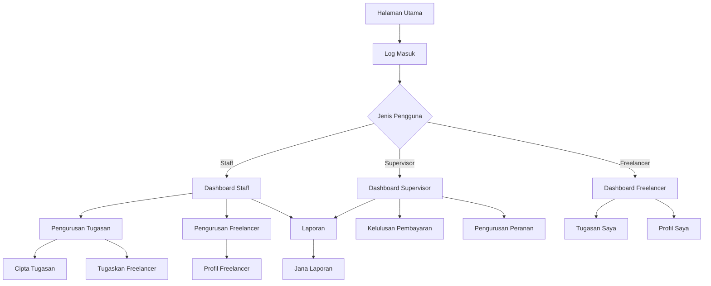

# Dokumen Keperluan Produk: Sistem Pengurusan Freelance IT Tech (SPFIT)

## 1. Gambaran Produk

Sistem Pengurusan Freelance IT Tech (SPFIT) adalah platform komprehensif untuk menguruskan teknisi IT freelance, penugasan tugas, dan pembayaran dalam organisasi.
Sistem ini menyelesaikan masalah pengurusan manual teknisi freelance dengan menyediakan platform digital yang memudahkan penugasan, pemantauan, dan pembayaran.
Sistem ini menyasarkan organisasi yang memerlukan perkhidmatan sokongan IT secara berkala dan ingin mengoptimumkan pengurusan freelancer mereka.

## 2. Ciri-ciri Utama

### 2.1 Peranan Pengguna

| Peranan        | Kaedah Pendaftaran                 | Kebenaran Utama                                                            |
| -------------- | ---------------------------------- | -------------------------------------------------------------------------- |
| Staff          | Pendaftaran dalaman oleh admin     | Boleh menguruskan tugasan, freelancer, dan laporan                         |
| Supervisor     | Pendaftaran dalaman oleh admin     | Semua kebenaran Staff ditambah kelulusan pembayaran dan pengurusan peranan |
| Freelance Tech | Pendaftaran sendiri melalui borang | Hanya boleh melihat dan menguruskan tugasan yang diberikan kepada mereka   |

### 2.2 Modul Ciri

Keperluan sistem SPFIT terdiri daripada halaman-halaman utama berikut:

1. **Halaman Dashboard**: paparan statistik, tugasan terkini, dan navigasi utama
2. **Halaman Pengurusan Tugasan**: senarai tugasan, penciptaan tugasan, penugasan, dan pemantauan status
3. **Halaman Pengurusan Freelancer**: profil freelancer, kemahiran, lokasi, dan penilaian
4. **Halaman Laporan**: laporan tugasan, freelancer, dan kewangan
5. **Halaman Tetapan**: pengurusan pengguna, peranan, notifikasi, dan konfigurasi sistem
6. **Halaman Autentikasi**: log masuk dan pendaftaran
7. **Halaman Profil**: maklumat peribadi dan tetapan akaun

### 2.3 Butiran Halaman

| Nama Halaman          | Nama Modul              | Penerangan Ciri                                                                         |
| --------------------- | ----------------------- | --------------------------------------------------------------------------------------- |
| Dashboard Admin/Staff | Statistik Tugasan       | Paparkan jumlah tugasan (total, baru), freelancer (total, tersedia), dan carta prestasi |
| Dashboard Admin/Staff | Senarai Tugasan Terkini | Paparkan 5 tugasan terbaru dengan status, tarikh, dan butang tindakan                   |
| Dashboard Freelancer  | Statistik Peribadi      | Paparkan tugasan aktif, jumlah pendapatan, rating purata, dan kemajuan                  |
| Dashboard Freelancer  | Tugasan Baharu          | Paparkan tugasan baharu yang sesuai dengan kemahiran dan lokasi freelancer              |
| Dashboard Supervisor  | Statistik Kelulusan     | Paparkan tugasan menunggu kelulusan pembayaran, jumlah pembayaran, tugasan selesai      |
| Dashboard Supervisor  | Senarai Kelulusan       | Paparkan tugasan yang memerlukan kelulusan pembayaran dengan butang lulus/tolak         |
| Pengurusan Tugasan    | Senarai Tugasan         | Paparkan semua tugasan dengan penapis status, tarikh, lokasi, dan carian                |
| Pengurusan Tugasan    | Borang Tugasan          | Cipta/edit tugasan dengan maklumat lengkap, lampiran, dan pautan                        |
| Pengurusan Tugasan    | Butiran Tugasan         | Paparkan maklumat lengkap tugasan, sejarah status, laporan, dan maklum balas            |
| Pengurusan Tugasan    | Penugasan Freelancer    | Pilih dan tugaskan freelancer berdasarkan kemahiran dan lokasi                          |
| Pengurusan Freelancer | Senarai Freelancer      | Paparkan semua freelancer dengan maklumat asas, status, dan rating                      |
| Pengurusan Freelancer | Profil Freelancer       | Paparkan/edit maklumat lengkap freelancer, kemahiran, lokasi, dan sejarah tugasan       |
| Pengurusan Freelancer | Penilaian Freelancer    | Sistem penilaian 5 bintang untuk kemahiran, komunikasi, ketepatan masa, dan respons     |
| Laporan               | Laporan Tugasan         | Jana laporan tugasan berdasarkan tempoh, status, lokasi, dan jenis sokongan             |
| Laporan               | Laporan Freelancer      | Jana laporan prestasi freelancer, rating, dan statistik tugasan                         |
| Laporan               | Laporan Kewangan        | Jana laporan pembayaran, pendapatan, dan analisis kos                                   |
| Tetapan Sistem        | Pengurusan Pengguna     | Tambah/edit/padam pengguna, tetapkan peranan, dan status akaun                          |
| Tetapan Sistem        | Pengurusan Peranan      | Cipta/edit peranan dengan kebenaran khusus dan hak akses                                |
| Tetapan Sistem        | Tetapan E-mel           | Konfigurasi pelayan SMTP, templat e-mel, dan notifikasi automatik                       |
| Tetapan Sistem        | Webhook & API           | Konfigurasi webhook untuk integrasi dengan sistem luar (Slack, Telegram, Discord)       |
| Tetapan Sistem        | Templat Notifikasi      | Cipta/edit templat untuk e-mel dan webhook dengan pembolehubah dinamik                  |
| Autentikasi           | Halaman Log Masuk       | Borang log masuk dengan e-mel/kata laluan dan ingat saya                                |
| Autentikasi           | Halaman Pendaftaran     | Borang pendaftaran freelancer dengan maklumat peribadi, kemahiran, dan lokasi           |
| Profil Pengguna       | Maklumat Peribadi       | Papar/edit nama, e-mel, telefon, dan maklumat akaun                                     |
| Profil Pengguna       | Tetapan Akaun           | Tukar kata laluan, tetapan notifikasi, dan keutamaan sistem                             |
| Profil Freelancer     | Kemahiran & Lokasi      | Edit senarai kemahiran teknikal dan kawasan operasi                                     |
| Profil Freelancer     | Sejarah Tugasan         | Paparkan senarai tugasan lepas dengan status dan penilaian                              |

## 3. Proses Utama

### Aliran Staff/Admin:

1. Staff log masuk ke sistem
2. Melihat dashboard dengan statistik tugasan dan freelancer
3. Mencipta tugasan baharu dengan maklumat lengkap
4. Menugaskan freelancer berdasarkan kemahiran dan lokasi
5. Memantau kemajuan tugasan dan mengesahkan laporan
6. Menandakan pembayaran sebagai selesai
7. Menjana laporan untuk analisis prestasi

### Aliran Supervisor:

1. Supervisor log masuk ke sistem
2. Melihat dashboard dengan tugasan menunggu kelulusan
3. Menyemak laporan tugasan yang dikemukakan
4. Meluluskan atau menolak pembayaran
5. Menguruskan peranan dan kebenaran pengguna
6. Memantau prestasi keseluruhan sistem

### Aliran Freelancer:

1. Freelancer mendaftar akaun dengan maklumat peribadi
2. Melengkapkan profil dengan kemahiran dan lokasi
3. Melihat tugasan baharu yang sesuai di dashboard
4. Menerima tugasan yang ditugaskan
5. Melaksanakan tugasan dan mengemukakan laporan
6. Menerima maklum balas dan penilaian
7. Melihat pendapatan dan statistik peribadi

## 4. Reka Bentuk Antara Muka Pengguna

### 4.1 Gaya Reka Bentuk

* **Warna Utama**: Biru (#3B82F6) untuk elemen utama, Hijau (#10B981) untuk status positif

* **Warna Sekunder**: Kelabu (#6B7280) untuk teks sekunder, Merah (#EF4444) untuk amaran

* **Gaya Butang**: Bulat dengan sudut 8px, efek hover dengan perubahan warna

* **Font**: Inter atau system font dengan saiz 14px untuk teks biasa, 16px untuk tajuk

* **Gaya Layout**: Reka bentuk kad dengan bayangan halus, navigasi atas dengan sidebar

* **Ikon**: Heroicons atau Lucide React dengan gaya minimalis dan konsisten

### 4.2 Gambaran Reka Bentuk Halaman

| Nama Halaman          | Nama Modul       | Elemen UI                                                                     |
| --------------------- | ---------------- | ----------------------------------------------------------------------------- |
| Dashboard             | Kad Statistik    | Kad putih dengan ikon berwarna, nombor besar, dan teks penerangan             |
| Dashboard             | Senarai Tugasan  | Jadual dengan baris berselang-seli, butang status berwarna, dan ikon tindakan |
| Pengurusan Tugasan    | Borang Tugasan   | Layout 2 lajur dengan input berlabel, dropdown, dan kawasan teks              |
| Pengurusan Tugasan    | Senarai Tugasan  | Jadual responsif dengan penapis atas, carian, dan pagination                  |
| Pengurusan Freelancer | Kad Freelancer   | Kad dengan avatar, maklumat asas, badge kemahiran, dan rating bintang         |
| Laporan               | Graf Statistik   | Chart.js dengan warna konsisten, tooltip, dan legenda                         |
| Tetapan               | Tab Navigation   | Tab horizontal dengan ikon, kandungan bertukar, dan butang simpan             |
| Autentikasi           | Borang Log Masuk | Borang tengah dengan logo, input berlabel, dan butang utama                   |

### 4.3 Responsif

Sistem direka bentuk desktop-first dengan adaptasi mobile yang mengoptimumkan interaksi sentuh. Layout menggunakan CSS Grid dan Flexbox untuk penyesuaian automatik pada skrin kecil, dengan navigasi bertukar kepada menu hamburger pada peranti mudah alih.

## 5. Keperluan Teknikal

### 5.1 Teknologi Frontend

* React 19 dengan TypeScript untuk pembangunan komponen

* Vite sebagai build tool untuk prestasi optimum

* Tailwind CSS untuk styling yang konsisten

* React Router untuk navigasi halaman

* Axios untuk komunikasi API

### 5.2 Teknologi Backend

* Node.js dengan Express.js untuk API server

* MySQL 8.0+ untuk pangkalan data

* TypeORM atau Prisma untuk ORM

* JWT untuk autentikasi

* Multer untuk muat naik fail

### 5.3 Ciri Keselamatan

* Autentikasi berasaskan JWT dengan tempoh luput

* Kawalan akses berasaskan peranan (RBAC)

* Pengesahan input di bahagian pelayan

* Penyulitan kata laluan dengan bcrypt

* Perlindungan CSRF dan XSS

### 5.4 Prestasi

* Lazy loading untuk komponen besar

* Pagination untuk senarai data besar

* Caching untuk data yang kerap diakses

* Optimisasi imej dan fail statik

* Monitoring prestasi aplikasi

## 6. Integrasi Sistem

### 6.1 API Luaran

* Gemini AI untuk analisis dan cadangan

* Webhook untuk Slack, Telegram, dan Discord

* SMTP untuk penghantaran e-mel

* Sistem pembayaran (opsional untuk fasa akan datang)

### 6.2 Format Data

* JSON untuk komunikasi API

* CSV/Excel untuk eksport laporan

* PDF untuk dokumen rasmi

* Imej (JPEG, PNG) untuk lampiran tugasan

## 7. Keperluan Prestasi

* Masa muat halaman: < 2 saat

* Masa respons API: < 500ms

* Sokongan pengguna serentak: 100+ pengguna

* Ketersediaan sistem: 99.5% uptime

* Saiz fail muat naik maksimum: 10MB

* Backup data harian automatik

## 8. Keperluan Kebolehgunaan

* Antara muka intuitif dengan pembelajaran minimal

* Sokongan pelbagai pelayar (Chrome, Firefox, Safari, Edge)

* Aksesibiliti untuk pengguna kurang upaya (WCAG 2.1)

* Sokongan dwibahasa (Bahasa Malaysia dan Inggeris)

* Bantuan dalam talian dan dokumentasi pengguna

* Maklum balas ralat yang jelas dan membantu

